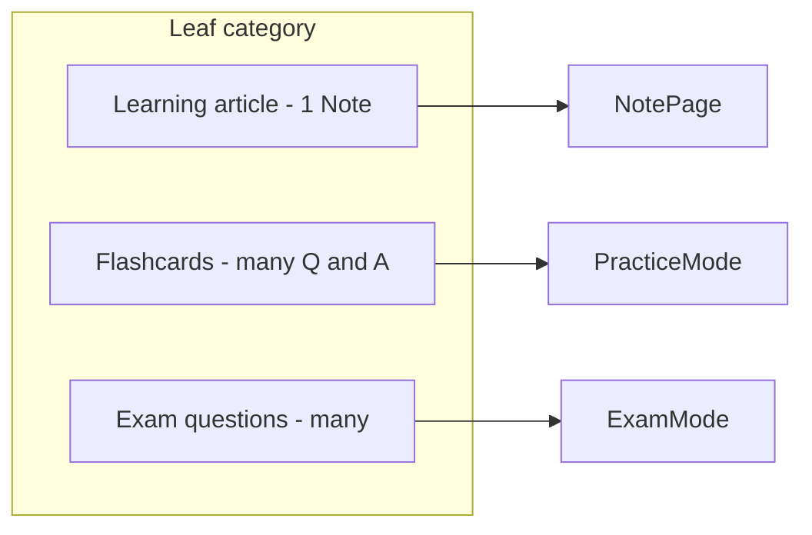

# Leaf Content, Flashcards, and Exam Questions – Implementation Plan

## Current state

- **Categories (V2):** `[src/types/firestore.ts](src/types/firestore.ts)` – `Category` with `isLeaf`; leaf categories can hold notes.
- **Notes:** Firestore `notes` with `categoryId`, `title`, `content` (HTML), optional `interviewAnswer`. Admin allows multiple notes per leaf (`[src/pages/admin/NotesManage.tsx](src/pages/admin/NotesManage.tsx)`).
- **Practice:** `[src/data/flashcards.ts](src/data/flashcards.ts)` – static `flashcardData` keyed by **noteId**; one “flashcard” per note (question ≈ title, answer = `interviewAnswer`). `[src/pages/ReviewPage.tsx](src/pages/ReviewPage.tsx)` and `[src/lib/validateAnswer.ts](src/lib/validateAnswer.ts)` use this for AI scoring.
- **Exam questions:** Do not exist.

## Target model

- **One learning article per leaf:** One Note per leaf category whose `content` is the learning article (enforced in admin or by treating the single/first note as the article).
- **Flashcards per leaf:** New Firestore collection; multiple question/answer pairs per leaf for practice; practice mode loads by `categoryId`.
- **Exam questions per leaf:** New Firestore collection; multiple questions per leaf for exams; new exam flow with scoring.

---

## 1. Data model and Firestore

### 1.1 Learning content (existing Note)

- Keep using **one Note per leaf** as the learning article: `notes.categoryId` = leaf id, `notes.content` = article HTML.
- In admin and UI: when displaying “content for this leaf,” use the single note for that category (create one if missing, or the first by `order`). No schema change.

### 1.2 Flashcards collection (new)

- **Collection:** `flashcards`
- **Fields:** `categoryId` (string, leaf id), `question` (string), `answer` (string), `order` (number), `createdAt`, `updatedAt` (timestamps).
- **Index:** composite on `(categoryId, order)` for listing by leaf.
- **Security:** Same as notes: read if authenticated; create/update/delete if admin.

### 1.3 Exam questions collection (new)

- **Collection:** `exam_questions`
- **Fields:** `categoryId` (string), `question` (string), `type` (`'mcq'` | `'short'`), `options` (array of strings, required for MCQ), `correctAnswer` (string), `order` (number), `createdAt`, `updatedAt`.
- **Index:** composite on `(categoryId, order)`.
- **Security:** Read if authenticated; write if admin.

### 1.4 Types and rules

- **Types:** In `[src/types/firestore.ts](src/types/firestore.ts)` add `Flashcard` and `ExamQuestion` interfaces.
- **Rules:** In `[firestore.rules](firestore.rules)` add `match /flashcards/{id}` and `match /exam_questions/{id}` with read for authenticated, create/update/delete for admin; add `isValidFlashcard()` and `isValidExamQuestion()` and use them in the rules.
- **Indexes:** In `[firestore.indexes.json](firestore.indexes.json)` add composite indexes for `flashcards` and `exam_questions` on `(categoryId, order)`.

---

## 2. Backend / lib

- **Admin CRUD:** In `[src/lib/admin.ts](src/lib/admin.ts)` add:
  - `createFlashcard`, `updateFlashcard`, `deleteFlashcard`, `getFlashcardsByCategoryId`
  - `createExamQuestion`, `updateExamQuestion`, `deleteExamQuestion`, `getExamQuestionsByCategoryId`
- **Hooks:** New hooks (or extend existing):
  - `useFlashcards(categoryId)` – real-time list of flashcards for a leaf.
  - `useExamQuestions(categoryId)` – real-time list of exam questions for a leaf.
- **Optional – exam attempts:** If you want to persist exam results, add collection `exam_attempts` (e.g. under `users/{uid}/exam_attempts` or a top-level collection with `userId`) with `categoryId`, `score`, `total`, `answers`, `createdAt`. Can be Phase 2.

---

## 3. Admin UI

### 3.1 Content (learning article) per leaf

- In **Notes manage** (`[src/pages/admin/NotesManage.tsx](src/pages/admin/NotesManage.tsx)`): when a leaf category is selected, treat the list as “learning article(s)” and encourage a single note per leaf (e.g. “Learning article” label, and optionally enforce “only one note per category” or auto-create one empty note per leaf when first opening).

### 3.2 Flashcards management

- New admin page or new section: **“Flashcards”** per leaf.
  - Select leaf category (reuse `CategorySelector` or same pattern as Notes).
  - List flashcards for that category (from `useFlashcards(categoryId)`); add / edit / delete; fields: question, answer, order.
  - Call admin `createFlashcard` / `updateFlashcard` / `deleteFlashcard`.

### 3.3 Exam questions management

- New admin page or section: **“Exam questions”** per leaf.
  - Select leaf category.
  - List exam questions; add / edit / delete; fields: question, type (MCQ / short), options (if MCQ), correctAnswer, order.
  - Call admin CRUD for exam questions.
- **Navigation:** Add “Flashcards” and “Exam questions” (or “Exams”) under Admin in `[src/components/AdminLayout.tsx](src/components/AdminLayout.tsx)`, routing in `[src/App.tsx](src/App.tsx)`.

---

## 4. Practice mode (flashcards)

- **Data source:** Replace static `[src/data/flashcards.ts](src/data/flashcards.ts)` usage in `[src/pages/ReviewPage.tsx](src/pages/ReviewPage.tsx)` with Firestore:
  - Load flashcards by category: e.g. when starting “Practice all” or “Practice this category,” query `flashcards` by `categoryId`(s).
  - One “card” = one flashcard doc (question + answer). Keep using `[src/lib/validateAnswer.ts](src/lib/validateAnswer.ts)` to compare user answer with `flashcard.answer`.
- **Decks:** “Practice all” = all categories that have at least one flashcard; “Practice this leaf” = flashcards for that leaf (e.g. from Graph or Note page with `categoryId`).
- **Progress:** Today progress is per-note (`[src/lib/progress.ts](src/lib/progress.ts)`, keyed by noteId. For practice keyed by flashcard, you can either:
  - Keep progress keyed by `flashcardId` (and optionally show per-category aggregate), or
  - Keep a single “practice score” per category (e.g. store by `categoryId`). Decide and extend progress types/hooks accordingly.

---

## 5. Exam mode (new)

- **New route:** e.g. `/exam` or `/review/exam` (or `/exam/:categoryId` for a single leaf).
- **Flow:**
  1. User selects one or more leaf categories (or “all leaves with exam questions”).
  2. Load `exam_questions` for selected categories; shuffle or order by `order`.
  3. Show one question at a time: question text, and for MCQ the options (radio/buttons), for short a text input.
  4. On submit: compare with `correctAnswer` (exact or normalized for short; exact for MCQ), compute score (e.g. correct / total), show result.
  5. Optional: save attempt to `exam_attempts` and show history on dashboard.
- **UI:** New page component (e.g. `ExamPage.tsx`), reuse styling from ReviewPage where appropriate. Link to exam from Home, Dashboard, or from the leaf/graph view (“Take exam for this topic”).

---

## 6. Leaf view and navigation

- **Note page** (`[src/pages/NotePage.tsx](src/pages/NotePage.tsx)`): Already shows one note’s content; ensure the note shown for a leaf is the one used as “learning article” (e.g. only note for that `categoryId`, or first by order).
- **Graph:** When opening a leaf, “content” link can go to the note for that leaf (current behavior if one note per leaf). Add “Practice” (flashcards for this leaf) and “Exam” (exam for this leaf) links that pass `categoryId` to Review and Exam.

---

## 7. Migration and cleanup

- **Static flashcards:** Remove or deprecate `[src/data/flashcards.ts](src/data/flashcards.ts)` once ReviewPage reads from Firestore. Optional: one-time script or admin action to import existing `flashcardData` into `flashcards` (e.g. by mapping noteId → categoryId via note’s `categoryId`, one flashcard per note with `interviewAnswer`).
- **Note interviewAnswer:** Can keep for backward compatibility or gradually drop once all practice uses `flashcards` collection.

---

## 8. Implementation order (recommended)

1. **Types + Firestore:** Add `Flashcard` and `ExamQuestion` types, rules, indexes; deploy rules and indexes.
2. **Admin CRUD + hooks:** Implement flashcards and exam_questions in `admin.ts` and hooks.
3. **Admin UI:** Flashcards and Exam questions management pages + routes.
4. **Practice mode:** Switch ReviewPage to Firestore flashcards; adjust deck building and progress if needed.
5. **Exam mode:** Exam page, routing, and links from app.
6. **Content semantics:** Enforce or document “one note per leaf = learning article” in NotesManage and any copy.
7. **Migration:** Optional import of static flashcard data; remove static flashcard usage.

---

## 9. Files to add or change (summary)

| Area            | Files                                                                                                                                                                 |
| --------------- | --------------------------------------------------------------------------------------------------------------------------------------------------------------------- |
| Types           | `[src/types/firestore.ts](src/types/firestore.ts)` – add Flashcard, ExamQuestion                                                                                      |
| Rules + indexes | `[firestore.rules](firestore.rules)`, `[firestore.indexes.json](firestore.indexes.json)`                                                                              |
| Lib             | `[src/lib/admin.ts](src/lib/admin.ts)` – flashcard and exam question CRUD                                                                                             |
| Hooks           | New `useFlashcards.ts`, `useExamQuestions.ts` (or single `useLeafContent.ts` that exposes both)                                                                       |
| Admin UI        | New pages/sections for Flashcards and Exam questions; `[AdminLayout.tsx](src/components/AdminLayout.tsx)`, `[App.tsx](src/App.tsx)` routes                            |
| Practice        | `[src/pages/ReviewPage.tsx](src/pages/ReviewPage.tsx)` – use Firestore flashcards; optionally `[src/hooks/useProgress.ts](src/hooks/useProgress.ts)` / progress types |
| Exam            | New `ExamPage.tsx`, route, links from Home/Graph/Note                                                                                                                 |
| Cleanup         | Remove or migrate `[src/data/flashcards.ts](src/data/flashcards.ts)`; update any `getNoteById`/static note usage in ReviewPage                                        |

This keeps the leaf as the single anchor: one content (note), many flashcards, many exam questions, with clear admin flows and a path to migrate off static data.