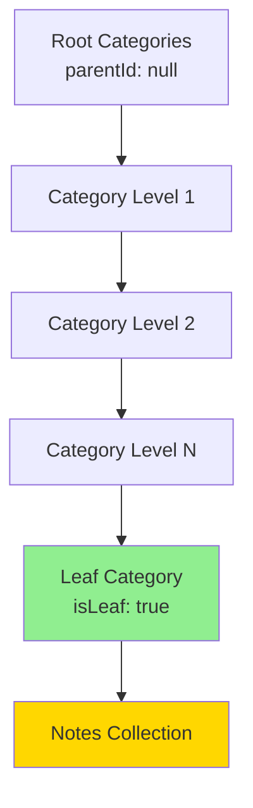
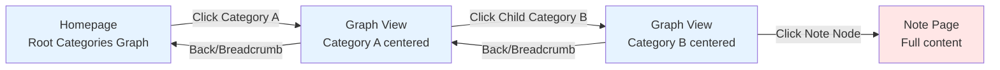
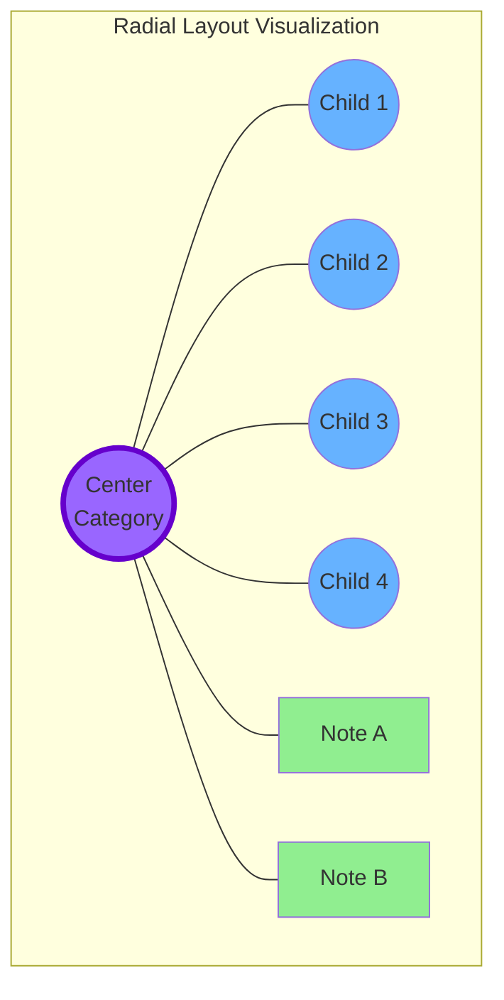
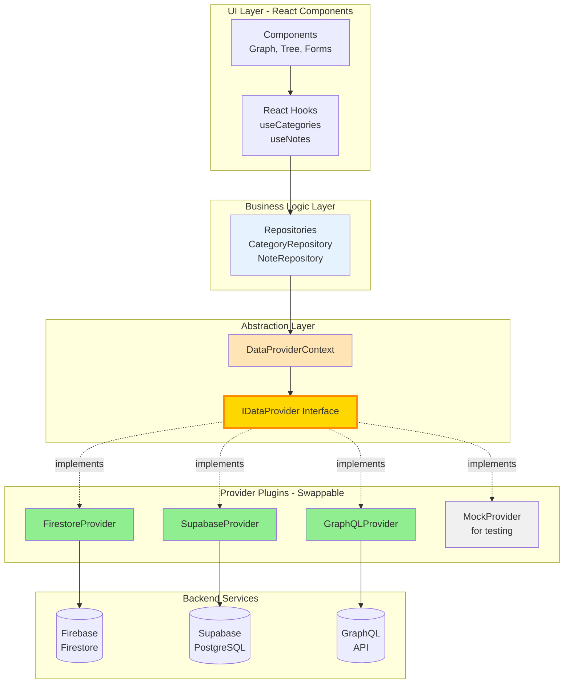

# Unlimited Category Nesting Architecture

## Overview

Implement a self-referential tree structure allowing unlimited category nesting levels. Categories replace the rigid Subject/Category/Subcategory/SubSubcategory model with a flexible parent-child relationship.

## Current State Analysis

**Current Structure (4 fixed levels):**

```
Subject (root)
  └── Category (level 1)
      └── Subcategory (level 2)
          └── SubSubcategory (level 3)
              └── Note (leaf)
```

**Files affected:**

- `[src/types/firestore.ts](src/types/firestore.ts)` - Type definitions
- `[src/lib/admin.ts](src/lib/admin.ts)` - CRUD operations
- `[firestore.rules](firestore.rules)` - Security rules
- Admin UI: `[src/pages/admin/CategoriesManage.tsx](src/pages/admin/CategoriesManage.tsx)`
- Various hooks and components

## New Architecture

### Data Model (Tree Structure)

**Single `Category` type with self-reference:**

```typescript
interface Category {
  id: string
  parentId: string | null  // null = root category (formerly Subject)
  name: string
  description?: string
  icon?: string
  color?: string
  isLeaf: boolean  // true = can contain Notes, false = can contain child Categories
  order: number
  depth: number  // computed field for UI rendering
  path: string[]  // ancestor IDs for efficient queries [grandparentId, parentId]
  createdAt?: Date
  updatedAt?: Date
}
```

**Updated `Note` type:**

```typescript
interface Note {
  id: string
  categoryId: string  // direct parent category (must be isLeaf=true)
  path: string[]  // full category path for breadcrumbs/queries
  title: string
  content: string
  interviewAnswer?: string
  order: number
  createdAt?: Date
  updatedAt?: Date
}
```

**Benefits:**

- Unlimited nesting (1 to N levels)
- Efficient queries using `path` array
- Clear distinction: container categories vs leaf categories
- Simpler data model (1 collection vs 4)

### Firestore Collections

**Before:** `subjects`, `categories`, `subcategories`, `subSubcategories`, `notes`

**After:** `categories`, `notes`

**Indexes needed:**

```json
{
  "indexes": [
    {
      "collectionGroup": "categories",
      "queryScope": "COLLECTION",
      "fields": [
        { "fieldPath": "parentId", "order": "ASCENDING" },
        { "fieldPath": "order", "order": "ASCENDING" }
      ]
    },
    {
      "collectionGroup": "notes",
      "queryScope": "COLLECTION",
      "fields": [
        { "fieldPath": "categoryId", "order": "ASCENDING" },
        { "fieldPath": "order", "order": "ASCENDING" }
      ]
    }
  ]
}
```

## Implementation Steps

### Phase 1: Backend - Data Model & Types

**1.1 Update Type Definitions** (`[src/types/firestore.ts](src/types/firestore.ts)`)

- Replace Subject, Category, Subcategory, SubSubcategory with unified `Category` interface
- Add `parentId`, `isLeaf`, `depth`, `path` fields
- Update `Note` to use single `categoryId` and `path` array
- Keep backward compatibility types for migration

**1.2 Update CRUD Operations** (`[src/lib/admin.ts](src/lib/admin.ts)`)

- Replace separate CRUD functions with unified `createCategory`, `updateCategory`, `deleteCategory`
- Add logic to compute `depth` and `path` on create/update
- Add `deleteCategory` with cascade option (delete children or prevent deletion)
- Add helper functions:
  - `getCategoryChildren(parentId)` - Get direct children
  - `getCategoryDescendants(parentId)` - Get all descendants recursively
  - `getCategoryAncestors(categoryId)` - Get full path to root
  - `canDeleteCategory(categoryId)` - Check if has children/notes

**1.3 Update React Hooks**

- Create unified `useCategories(parentId)` hook (replaces useSubjects, useCategories, useSubcategories, useSubSubcategories)
- Create `useCategoryTree(rootId?)` hook - Returns hierarchical tree structure
- Create `useCategoryPath(categoryId)` hook - Returns breadcrumb path
- Update `useNotes(categoryId)` hook - Query by single categoryId

### Phase 2: Firestore Security Rules

**Update** `[firestore.rules](firestore.rules)`:

- Replace 4 separate category rules with single `categories` rule
- Add validation for `parentId`, `isLeaf`, `depth`, `path` fields
- Add rule: if `isLeaf=true`, cannot have child categories
- Add rule: if `isLeaf=false`, cannot have notes directly
- Update `isValidCategory()` function with new schema
- Update `isValidNote()` to validate single `categoryId` and `path`

### Phase 3: Admin UI - Tree Management

**3.1 Create New Admin Page** (`[src/pages/admin/CategoriesTreeManage.tsx](src/pages/admin/CategoriesTreeManage.tsx)`)

**Features:**

- **Tree View Component** with expand/collapse
  - Show hierarchy visually (indentation, lines)
  - Drag-and-drop reordering (within same parent)
  - Inline create, edit, delete buttons
  - Toggle `isLeaf` status (with validation)
  - Display depth level and children count
- **Category Form Modal**
  - Select parent category (dropdown with indentation showing hierarchy)
  - Name, description, icon, color fields
  - `isLeaf` checkbox (if true, can add Notes; if false, can add child Categories)
  - Order field
  - Show computed depth and path preview
- **Actions:**
  - Create root category (parentId = null)
  - Create child category (select parent)
  - Edit category (can change parent = move in tree)
  - Delete category (with warning if has children/notes)
  - Convert category: container ↔ leaf (with validation)

**UI Components to create:**

- `CategoryTreeView.tsx` - Recursive tree renderer
- `CategoryTreeNode.tsx` - Single node with expand/collapse
- `CategoryFormModal.tsx` - Create/edit form
- `CategorySelector.tsx` - Hierarchical dropdown for parent selection

**3.2 Update Admin Navigation**

- Replace "Subjects", "Categories" tabs with single "Categories" tab
- Keep "Notes" tab (updated to work with new structure)

### Phase 4: React Flow Installation

**Install React Flow library:**

```bash
npm install reactflow
```

React Flow provides:

- Interactive graph visualization
- Custom node/edge rendering
- Built-in zoom, pan, drag capabilities
- Layout algorithms (we'll implement custom radial layout)

### Phase 5: Frontend - Graph-Based Navigation (React Flow)

**5.1 Navigation Flow with React Flow**

**Primary Navigation:** Interactive graph visualization with radial layout

**User Journey:**

1. Start at homepage → Shows all root categories as initial graph
2. Click a category node → Re-center graph with that category in center, children in circle
3. Click another category → Smooth transition, re-layout graph
4. Click a note/item node → Navigate to full note page

**Routes:**

- `/` - Homepage with root categories graph
- `/graph/:categoryId` - Graph view centered on specific category
- `/note/:noteId` - Full note page

**5.2 React Flow Components**

**A. Custom Node Types**

Create custom nodes in `src/components/graph/`:

`**CategoryNode.tsx**` - Category node component

```typescript
interface CategoryNodeData {
  category: Category
  isCenter: boolean  // true if this is the focused center node
  childrenCount: number
  noteCount: number
}
```

- Visual: Circular node with icon, name, badges
- Center node: Larger, highlighted, pulsing animation
- Peripheral nodes: Smaller, connected by edges
- Color coding by depth or custom category color
- Show children/note count badges

`**NoteNode.tsx**` - Note/item node component

```typescript
interface NoteNodeData {
  note: Note
  progress?: number
}
```

- Visual: Rectangular or rounded rect node
- Show note title, progress indicator
- Different styling from category nodes (e.g., different shape/color)

**B. Layout Logic**

`**useRadialLayout.ts**` - Custom hook for radial layout

```typescript
function useRadialLayout(
  centerNode: Category | null,
  children: (Category | Note)[],
  radius: number = 300
) {
  // Positions nodes in a circle around center
  // Returns: { nodes, edges } for React Flow
}
```

Algorithm:

1. Place center category at (0, 0)
2. Calculate positions for children in circle:
  - Divide 360° by number of children
  - Place each child at angle θ, radius R from center
  - Formula: x = R × cos(θ), y = R × sin(θ)
3. Create edges from center to each child
4. Add smooth animated transitions

**C. Main Graph Component**

`**CategoryGraphView.tsx**` - Main graph visualization

```typescript
interface CategoryGraphViewProps {
  centerCategoryId: string | null  // null = show root categories
  onNodeClick: (nodeId: string, nodeType: 'category' | 'note') => void
}
```

Features:

- React Flow canvas with custom nodes
- Controls: zoom in/out, fit view, fullscreen
- Mini-map in corner (optional)
- Smooth transitions when changing center node
- Loading states while fetching data
- Empty states (no children)

**D. Graph Interaction Hook**

`**useGraphNavigation.ts**` - Manage graph state and transitions

```typescript
function useGraphNavigation(categoryId: string | null) {
  const centerCategory = useCategory(categoryId)
  const children = useCategories(categoryId)
  const notes = useNotes(categoryId)
  
  // Combine children categories and notes
  const graphData = useMemo(() => {
    return buildGraphData(centerCategory, children, notes)
  }, [centerCategory, children, notes])
  
  return {
    graphData,
    handleNodeClick,
    isLoading
  }
}
```

**5.3 Updated Pages**

`**HomePage.tsx**` - Graph view of root categories

```typescript
function HomePage() {
  const navigate = useNavigate()
  
  const handleNodeClick = (nodeId: string, nodeType: 'category' | 'note') => {
    if (nodeType === 'category') {
      navigate(`/graph/${nodeId}`)
    } else {
      navigate(`/note/${nodeId}`)
    }
  }
  
  return (
    <div className="h-screen">
      <CategoryGraphView 
        centerCategoryId={null} 
        onNodeClick={handleNodeClick}
      />
    </div>
  )
}
```

`**GraphPage.tsx**` - NEW page for focused category view

```typescript
function GraphPage() {
  const { categoryId } = useParams()
  const navigate = useNavigate()
  
  return (
    <div className="h-screen flex flex-col">
      {/* Breadcrumb at top */}
      <CategoryBreadcrumb categoryId={categoryId} />
      
      {/* Graph fills remaining space */}
      <CategoryGraphView 
        centerCategoryId={categoryId}
        onNodeClick={handleNodeClick}
      />
    </div>
  )
}
```

**5.4 Enhanced Features**

**Search & Filter:**

- Search bar to find and focus on specific categories
- Filter by depth, has notes, progress level
- Highlight matching nodes in graph

**Visual Indicators:**

- Progress rings around category nodes
- Color coding: completed (green), in-progress (yellow), not-started (gray)
- Node size based on number of descendants
- Edge thickness based on number of notes

**Animations:**

- Smooth zoom/pan to center node when navigating
- Node entrance animations (fade in, scale up)
- Pulse effect on center node
- Hover effects with tooltips

**Accessibility:**

- Keyboard navigation (arrow keys to navigate nodes)
- Focus indicators
- Screen reader support for node labels
- Alt text for visual elements

### Phase 6: Migration Strategy

**Update Progress System:**

- Currently: `/users/{userId}/progress/{subjectId}/state`
- New: `/users/{userId}/progress/{rootCategoryId}/state`
- Structure stays same: `{ notes: { [noteId]: { score: number } } }`
- Update progress hooks to query by root category (depth=0)
- Display progress indicators on graph nodes (colored rings/badges)

### Phase 7: Migration Strategy

**Fresh Start Approach:**

1. Deploy new schema alongside old collections
2. Keep old `subjects`, `categories`, `subcategories`, `subSubcategories` as read-only
3. New `categories` collection starts empty
4. Admin manually recreates structure OR run migration script
5. Notes can be bulk-updated with script to use new `categoryId` and `path`

**Optional Migration Script** (if data preservation needed):

```typescript
// Pseudo-code
async function migrateToTreeStructure() {
  // 1. Convert Subjects → Root Categories (parentId=null, depth=0)
  // 2. Convert Categories → Level 1 Categories (parentId=subjectId, depth=1)
  // 3. Convert Subcategories → Level 2 Categories (depth=2)
  // 4. Convert SubSubcategories → Level 3 Categories (depth=3, isLeaf=true)
  // 5. Update Notes with new categoryId and path array
  // 6. Update user progress documents
}
```

### Phase 8: Testing & Validation

1. **Data integrity tests:**
  - Orphaned categories (parentId not found)
  - Circular references (A → B → A)
  - Max depth validation (optional limit)
2. **UI tests:**
  - Create root category
  - Create nested category (3+ levels deep)
  - Move category to different parent
  - Delete category with children (should warn/prevent)
  - Add note to leaf category
  - Navigate breadcrumbs
3. **Security tests:**
  - Non-admin cannot create/update/delete
  - Cannot create note in non-leaf category
  - Path array matches actual parent chain
4. **Graph navigation tests:**
  - Click category node centers it with smooth transition
  - Click note node navigates to note page
  - Breadcrumb navigation works correctly
  - Graph handles large number of children (20+)
  - Zoom/pan controls work smoothly
  - Progress indicators display correctly on nodes
  - Empty states show when category has no children

## File Changes Summary

**New files:**

Admin UI (Tree-based):

- `src/pages/admin/CategoriesTreeManage.tsx` - Main admin UI
- `src/components/CategoryTreeView.tsx` - Recursive tree component
- `src/components/CategoryTreeNode.tsx` - Single tree node
- `src/components/CategoryFormModal.tsx` - Create/edit modal
- `src/components/CategorySelector.tsx` - Parent selector dropdown

User-Facing (Graph-based):

- `src/pages/GraphPage.tsx` - Graph navigation page
- `src/components/graph/CategoryGraphView.tsx` - Main graph component
- `src/components/graph/CategoryNode.tsx` - Custom category node
- `src/components/graph/NoteNode.tsx` - Custom note node
- `src/components/graph/GraphControls.tsx` - Zoom/pan/fit controls
- `src/components/CategoryBreadcrumb.tsx` - Breadcrumb navigation

Shared Hooks:

- `src/hooks/useCategoryTree.ts` - Tree data hook
- `src/hooks/useCategoryPath.ts` - Breadcrumb data hook
- `src/hooks/useGraphNavigation.ts` - Graph state management
- `src/hooks/useRadialLayout.ts` - Radial layout algorithm
- `src/hooks/useCategory.ts` - Single category hook

**Modified files:**

- `src/types/firestore.ts` - New Category & Note interfaces
- `src/lib/admin.ts` - Unified CRUD + helper functions
- `src/hooks/useCategories.ts` - Updated to use parentId filter
- `src/hooks/useNotes.ts` - Updated to use single categoryId
- `src/pages/HomePage.tsx` - Graph view of root categories
- `src/pages/admin/NotesManage.tsx` - Updated category selector
- `src/App.tsx` - Updated routes for graph navigation
- `package.json` - Add reactflow dependency
- `firestore.rules` - New validation rules
- `firestore.indexes.json` - New composite indexes

**Deprecated files (can be removed after migration):**

- `src/pages/admin/SubjectsManage.tsx`
- `src/components/SubjectCard.tsx`
- `src/components/SubcategoryCard.tsx`
- `src/components/SubSubcategoryCard.tsx`
- `src/hooks/useSubjects.ts`
- `src/hooks/useSubcategories.ts`
- `src/hooks/useSubSubcategories.ts`
- Static data files: `src/data/categories.ts`, `src/data/subcategories.ts`, `src/data/subSubcategories.ts`

## Architecture Diagrams

### Data Structure




### User Navigation Flow (React Flow Graph)




### React Flow Radial Layout Example




### Data Abstraction Layer Architecture (Phase 2)




## Key Design Decisions

1. **Self-referential structure** - `parentId` points to same collection (categories)
2. **Path array** - Denormalized for efficient breadcrumb queries (avoid recursive lookups)
3. **isLeaf flag** - Explicit distinction between container and content categories
4. **Depth field** - Computed on write for UI rendering and optional depth limits
5. **Fresh start** - Simpler than complex migration, admin recreates structure
6. **Dual UI approach:**
  - **Admin**: Tree view with expand/collapse for precise hierarchy management
  - **Users**: React Flow graph with radial layout for intuitive exploration
7. **Radial layout** - Center node (focused category) with children arranged in circle
8. **Navigate on click** - Clicking notes goes to full page (not modal/preview)

## Performance Considerations

- **Index**: Composite index on `(parentId, order)` for fast child queries
- **Path array**: Max 20 levels (Firestore array limit = 10,000 items, we use IDs ~20 chars)
- **Lazy loading**: Only load visible tree branches and current graph view
- **Caching**: Use React Query or similar for tree state management
- **Batch operations**: Delete cascades use Firestore batch writes
- **Graph optimization**: Only render center node + direct children (not entire tree)
- **React Flow performance**: Use `nodesFocusable={false}` for static graphs, memoize node components
- **Limit graph nodes**: Show max 20-30 children per view (paginate if more)

## Security Considerations

- Validate `path` array matches actual parent chain (prevent spoofing)
- Limit max depth (e.g., 20 levels) to prevent abuse
- Cascade delete requires admin confirmation
- Cannot change `isLeaf` if category has children or notes

---

## PHASE 2: Data Abstraction Layer (Future-Proof Plugin Architecture)

> **Implementation Timeline**: After Phase 1 features are complete and tested. This refactoring ensures easy migration to Supabase, GraphQL, or any backend.

### Architecture Overview

**Goal**: Completely decouple business logic from data persistence. Make backends swappable like Lego blocks.

**Pattern**: Plugin-based Data Access Layer with:

- Abstract provider interfaces
- Dependency injection
- Real-time subscription abstraction
- Provider-agnostic hooks

### Provider Interface Design

**Core abstraction in** `src/data/providers/IDataProvider.ts`:

```typescript
// Base types
export type Query<T> = {
  where?: Array<{ field: string; op: '==' | '!=' | '>' | '<' | '>=' | '<=' | 'in' | 'array-contains'; value: any }>
  orderBy?: Array<{ field: string; direction: 'asc' | 'desc' }>
  limit?: number
}

export type Subscription<T> = {
  unsubscribe: () => void
}

// Main provider interface
export interface IDataProvider {
  // CRUD Operations
  create<T>(collection: string, data: Omit<T, 'id'>): Promise<string>
  read<T>(collection: string, id: string): Promise<T | null>
  update<T>(collection: string, id: string, data: Partial<T>): Promise<void>
  delete(collection: string, id: string): Promise<void>
  
  // Query operations
  query<T>(collection: string, query: Query<T>): Promise<T[]>
  
  // Real-time subscriptions
  subscribe<T>(
    collection: string,
    query: Query<T>,
    onData: (data: T[]) => void,
    onError?: (error: Error) => void
  ): Subscription<T>
  
  // Batch operations
  batchWrite(operations: Array<{
    type: 'create' | 'update' | 'delete'
    collection: string
    id?: string
    data?: any
  }>): Promise<void>
  
  // Transaction support
  transaction<T>(callback: (tx: ITransaction) => Promise<T>): Promise<T>
}

// Transaction interface
export interface ITransaction {
  get<T>(collection: string, id: string): Promise<T | null>
  create<T>(collection: string, data: Omit<T, 'id'>): string
  update<T>(collection: string, id: string, data: Partial<T>): void
  delete(collection: string, id: string): void
}
```

### Provider Implementations

**1. Firestore Provider** (`src/data/providers/FirestoreProvider.ts`)

```typescript
import { IDataProvider, Query, Subscription } from './IDataProvider'
import { getFirestoreDb } from '../../lib/firebase'
import { 
  collection, doc, setDoc, getDoc, updateDoc, 
  deleteDoc, query, where, orderBy, limit,
  onSnapshot, writeBatch, runTransaction 
} from 'firebase/firestore'

export class FirestoreProvider implements IDataProvider {
  private db = getFirestoreDb()
  
  async create<T>(collectionName: string, data: Omit<T, 'id'>): Promise<string> {
    const docRef = doc(collection(this.db, collectionName))
    await setDoc(docRef, { ...data, createdAt: serverTimestamp() })
    return docRef.id
  }
  
  async read<T>(collectionName: string, id: string): Promise<T | null> {
    const docSnap = await getDoc(doc(this.db, collectionName, id))
    return docSnap.exists() ? { id: docSnap.id, ...docSnap.data() } as T : null
  }
  
  // ... implement all interface methods
  
  subscribe<T>(
    collectionName: string,
    queryDef: Query<T>,
    onData: (data: T[]) => void,
    onError?: (error: Error) => void
  ): Subscription<T> {
    let q = query(collection(this.db, collectionName))
    
    // Build query from definition
    queryDef.where?.forEach(w => {
      q = query(q, where(w.field, w.op, w.value))
    })
    queryDef.orderBy?.forEach(o => {
      q = query(q, orderBy(o.field, o.direction))
    })
    if (queryDef.limit) {
      q = query(q, limit(queryDef.limit))
    }
    
    const unsubscribe = onSnapshot(
      q,
      (snapshot) => {
        const data = snapshot.docs.map(doc => ({
          id: doc.id,
          ...doc.data()
        })) as T[]
        onData(data)
      },
      onError
    )
    
    return { unsubscribe }
  }
}
```

**2. Supabase Provider** (`src/data/providers/SupabaseProvider.ts`)

```typescript
import { IDataProvider, Query, Subscription } from './IDataProvider'
import { createClient, SupabaseClient } from '@supabase/supabase-js'

export class SupabaseProvider implements IDataProvider {
  private client: SupabaseClient
  
  constructor(url: string, key: string) {
    this.client = createClient(url, key)
  }
  
  async create<T>(table: string, data: Omit<T, 'id'>): Promise<string> {
    const { data: result, error } = await this.client
      .from(table)
      .insert(data)
      .select('id')
      .single()
    
    if (error) throw error
    return result.id
  }
  
  subscribe<T>(
    table: string,
    queryDef: Query<T>,
    onData: (data: T[]) => void,
    onError?: (error: Error) => void
  ): Subscription<T> {
    // Initial fetch
    this.query<T>(table, queryDef).then(onData).catch(onError)
    
    // Real-time subscription
    const channel = this.client
      .channel(`${table}_changes`)
      .on(
        'postgres_changes',
        { event: '*', schema: 'public', table },
        (payload) => {
          // Re-fetch data on change
          this.query<T>(table, queryDef).then(onData).catch(onError)
        }
      )
      .subscribe()
    
    return {
      unsubscribe: () => {
        this.client.removeChannel(channel)
      }
    }
  }
  
  // ... implement other methods
}
```

**3. GraphQL Provider** (`src/data/providers/GraphQLProvider.ts`)

```typescript
import { IDataProvider, Query, Subscription } from './IDataProvider'
import { ApolloClient, gql } from '@apollo/client'

export class GraphQLProvider implements IDataProvider {
  private client: ApolloClient<any>
  
  constructor(client: ApolloClient<any>) {
    this.client = client
  }
  
  async create<T>(typename: string, data: Omit<T, 'id'>): Promise<string> {
    const mutation = gql`
      mutation Create${typename}($data: ${typename}Input!) {
        create${typename}(data: $data) {
          id
        }
      }
    `
    const result = await this.client.mutate({ mutation, variables: { data } })
    return result.data[`create${typename}`].id
  }
  
  subscribe<T>(
    typename: string,
    queryDef: Query<T>,
    onData: (data: T[]) => void,
    onError?: (error: Error) => void
  ): Subscription<T> {
    const subscription = gql`
      subscription ${typename}Subscription {
        ${typename.toLowerCase()}s {
          id
          # ... fields
        }
      }
    `
    
    const observable = this.client.subscribe({ query: subscription })
    const sub = observable.subscribe({
      next: (result) => onData(result.data[`${typename.toLowerCase()}s`]),
      error: onError
    })
    
    return {
      unsubscribe: () => sub.unsubscribe()
    }
  }
  
  // ... implement other methods
}
```

### Dependency Injection Setup

**Provider Context** (`src/data/DataProviderContext.tsx`):

```typescript
import React, { createContext, useContext, ReactNode } from 'react'
import { IDataProvider } from './providers/IDataProvider'
import { FirestoreProvider } from './providers/FirestoreProvider'

const DataProviderContext = createContext<IDataProvider | null>(null)

export function DataProviderWrapper({ 
  children, 
  provider 
}: { 
  children: ReactNode
  provider?: IDataProvider 
}) {
  // Default to Firestore, but allow override
  const defaultProvider = provider || new FirestoreProvider()
  
  return (
    <DataProviderContext.Provider value={defaultProvider}>
      {children}
    </DataProviderContext.Provider>
  )
}

export function useDataProvider(): IDataProvider {
  const context = useContext(DataProviderContext)
  if (!context) {
    throw new Error('useDataProvider must be used within DataProviderWrapper')
  }
  return context
}
```

**App Setup** (`src/main.tsx`):

```typescript
import { DataProviderWrapper } from './data/DataProviderContext'
import { FirestoreProvider } from './data/providers/FirestoreProvider'

// Option 1: Use Firestore (default)
const provider = new FirestoreProvider()

// Option 2: Use Supabase (future)
// const provider = new SupabaseProvider(
//   import.meta.env.VITE_SUPABASE_URL,
//   import.meta.env.VITE_SUPABASE_KEY
// )

// Option 3: Use GraphQL (future)
// const apolloClient = new ApolloClient({ ... })
// const provider = new GraphQLProvider(apolloClient)

ReactDOM.createRoot(document.getElementById('root')!).render(
  <React.StrictMode>
    <DataProviderWrapper provider={provider}>
      <App />
    </DataProviderWrapper>
  </React.StrictMode>
)
```

### Repository Layer (Business Logic)

**Category Repository** (`src/repositories/CategoryRepository.ts`):

```typescript
import { useDataProvider } from '../data/DataProviderContext'
import type { Category } from '../types/firestore'

export class CategoryRepository {
  constructor(private provider: IDataProvider) {}
  
  async create(data: Omit<Category, 'id' | 'createdAt' | 'updatedAt'>): Promise<string> {
    // Compute depth and path
    let depth = 0
    let path: string[] = []
    
    if (data.parentId) {
      const parent = await this.provider.read<Category>('categories', data.parentId)
      if (parent) {
        depth = parent.depth + 1
        path = [...parent.path, parent.id]
      }
    }
    
    return this.provider.create<Category>('categories', {
      ...data,
      depth,
      path,
      createdAt: new Date(),
      updatedAt: new Date()
    })
  }
  
  async getChildren(parentId: string | null): Promise<Category[]> {
    return this.provider.query<Category>('categories', {
      where: [{ field: 'parentId', op: '==', value: parentId }],
      orderBy: [{ field: 'order', direction: 'asc' }]
    })
  }
  
  async getAncestors(categoryId: string): Promise<Category[]> {
    const category = await this.provider.read<Category>('categories', categoryId)
    if (!category || !category.path.length) return []
    
    const ancestors: Category[] = []
    for (const ancestorId of category.path) {
      const ancestor = await this.provider.read<Category>('categories', ancestorId)
      if (ancestor) ancestors.push(ancestor)
    }
    return ancestors
  }
  
  async deleteWithDescendants(categoryId: string): Promise<void> {
    // Get all descendants
    const descendants = await this.getDescendants(categoryId)
    
    // Batch delete
    const operations = [
      { type: 'delete' as const, collection: 'categories', id: categoryId },
      ...descendants.map(d => ({ 
        type: 'delete' as const, 
        collection: 'categories', 
        id: d.id 
      }))
    ]
    
    await this.provider.batchWrite(operations)
  }
  
  private async getDescendants(parentId: string): Promise<Category[]> {
    const children = await this.getChildren(parentId)
    const descendants: Category[] = [...children]
    
    for (const child of children) {
      const childDescendants = await this.getDescendants(child.id)
      descendants.push(...childDescendants)
    }
    
    return descendants
  }
}

// Factory hook
export function useCategoryRepository(): CategoryRepository {
  const provider = useDataProvider()
  return new CategoryRepository(provider)
}
```

### Provider-Agnostic React Hooks

**Refactored Hooks** (`src/hooks/useCategories.ts`):

```typescript
import { useState, useEffect } from 'react'
import { useDataProvider } from '../data/DataProviderContext'
import type { Category } from '../types/firestore'

export function useCategories(parentId: string | null) {
  const provider = useDataProvider()
  const [categories, setCategories] = useState<Category[]>([])
  const [loading, setLoading] = useState(true)
  const [error, setError] = useState<Error | null>(null)
  
  useEffect(() => {
    setLoading(true)
    
    const subscription = provider.subscribe<Category>(
      'categories',
      {
        where: [{ field: 'parentId', op: '==', value: parentId }],
        orderBy: [{ field: 'order', direction: 'asc' }]
      },
      (data) => {
        setCategories(data)
        setLoading(false)
      },
      (err) => {
        setError(err)
        setLoading(false)
      }
    )
    
    return () => subscription.unsubscribe()
  }, [parentId, provider])
  
  return { categories, loading, error }
}
```

**Admin Operations** (`src/lib/admin.ts` - Refactored):

```typescript
import { useDataProvider } from '../data/DataProviderContext'
import { useCategoryRepository } from '../repositories/CategoryRepository'

export function useAdminActions() {
  const categoryRepo = useCategoryRepository()
  
  return {
    createCategory: (data) => categoryRepo.create(data),
    updateCategory: (id, data) => categoryRepo.update(id, data),
    deleteCategory: (id) => categoryRepo.deleteWithDescendants(id),
    // ... other actions
  }
}
```

### Migration Path

**Step 1: Implement Interfaces** (Week 1)

- Create `IDataProvider` interface
- Create `FirestoreProvider` implementation
- Add `DataProviderContext`

**Step 2: Refactor Existing Code** (Week 2-3)

- Move direct Firestore calls to repositories
- Update hooks to use `useDataProvider()`
- Update admin functions to use repositories
- Test thoroughly - should work identically

**Step 3: Test Alternative Providers** (Week 4+)

- Implement `SupabaseProvider`
- Test switching providers via context
- Implement `GraphQLProvider`
- Document migration guide

### Provider Configuration

**Environment-based switching** (`.env`):

```bash
# Current: Firestore
VITE_DATA_PROVIDER=firestore
VITE_FIREBASE_PROJECT_ID=your-project

# Future: Supabase
VITE_DATA_PROVIDER=supabase
VITE_SUPABASE_URL=https://xxx.supabase.co
VITE_SUPABASE_ANON_KEY=xxx

# Future: GraphQL
VITE_DATA_PROVIDER=graphql
VITE_GRAPHQL_ENDPOINT=https://api.example.com/graphql
```

**Provider Factory** (`src/data/providerFactory.ts`):

```typescript
export function createProvider(): IDataProvider {
  const providerType = import.meta.env.VITE_DATA_PROVIDER || 'firestore'
  
  switch (providerType) {
    case 'firestore':
      return new FirestoreProvider()
    
    case 'supabase':
      return new SupabaseProvider(
        import.meta.env.VITE_SUPABASE_URL,
        import.meta.env.VITE_SUPABASE_ANON_KEY
      )
    
    case 'graphql':
      const client = new ApolloClient({
        uri: import.meta.env.VITE_GRAPHQL_ENDPOINT
      })
      return new GraphQLProvider(client)
    
    default:
      throw new Error(`Unknown provider: ${providerType}`)
  }
}
```

### Benefits of This Architecture

1. **Zero vendor lock-in** - Switch backends by changing one line
2. **Testable** - Mock `IDataProvider` for unit tests
3. **Flexible** - Add new providers without touching business logic
4. **Type-safe** - Full TypeScript support across providers
5. **Real-time agnostic** - Subscriptions work with Firestore, Supabase, GraphQL
6. **Progressive migration** - Refactor incrementally, feature by feature
7. **Future-proof** - Easy to add Redis cache layer, REST API, etc.

### File Structure

```
src/
  data/
    providers/
      IDataProvider.ts          // Interface
      FirestoreProvider.ts      // Firestore implementation
      SupabaseProvider.ts       // Supabase implementation
      GraphQLProvider.ts        // GraphQL implementation
    DataProviderContext.tsx     // React context
    providerFactory.ts          // Provider factory
  repositories/
    CategoryRepository.ts       // Business logic
    NoteRepository.ts
    UserProgressRepository.ts
  hooks/
    useCategories.ts            // Provider-agnostic hooks
    useNotes.ts
    useProgress.ts
```

### Testing Strategy

**Mock Provider for Tests**:

```typescript
export class MockDataProvider implements IDataProvider {
  private data: Map<string, Map<string, any>> = new Map()
  
  async create<T>(collection: string, data: Omit<T, 'id'>): Promise<string> {
    const id = Math.random().toString(36)
    if (!this.data.has(collection)) {
      this.data.set(collection, new Map())
    }
    this.data.get(collection)!.set(id, { id, ...data })
    return id
  }
  
  // ... implement all methods with in-memory storage
}

// In tests
const mockProvider = new MockDataProvider()
render(
  <DataProviderWrapper provider={mockProvider}>
    <CategoriesPage />
  </DataProviderWrapper>
)
```

This architecture makes your codebase completely database-agnostic and migration becomes a configuration change!

### Quick Migration Example

**To switch from Firestore to Supabase:**

1. Install Supabase client: `npm install @supabase/supabase-js`
2. Update `.env`: Change `VITE_DATA_PROVIDER=firestore` to `VITE_DATA_PROVIDER=supabase`
3. Add Supabase credentials to `.env`
4. Create matching database schema in Supabase (SQL script)
5. Restart app - **Done!** No code changes needed.

**Why This Matters:**

- **Cost**: Switch providers based on pricing
- **Features**: Use Supabase for built-in auth, Postgres features
- **Performance**: Move to GraphQL for optimized queries
- **Compliance**: Switch to self-hosted if needed
- **Testing**: Use MockProvider for fast, isolated tests
- **Development**: Local development with mock data

