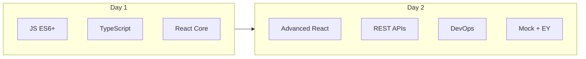

# 48-Hour React/EY Interview Prep

Single source of truth for the 48-hour schedule, with code examples and interview-style answers.



---

## Day 1 — Hour 1–4: JavaScript (ES6+) MUST-KNOWS

### let / const / var

**What it is:** `let` and `const` are block-scoped; `var` is function-scoped and hoisted. `const` cannot be reassigned; `let` can.

```javascript
// Block scope: x only exists inside the block
{
  let x = 1;
  const y = 2;
  var z = 3;
}
// console.log(x); // ReferenceError
// console.log(y); // ReferenceError
console.log(z); // 3 — var is function-scoped, so z leaks

// Temporal dead zone: can't use let/const before declaration
// console.log(a); // ReferenceError
let a = 10;
```

**Say in interview:** "`let` and `const` are block-scoped; `var` is function-scoped and hoisted. I prefer `const` by default, `let` when reassigning."

---

### Closures

**What it is:** A closure is when an inner function keeps access to its outer scope even after the outer function has returned.

```javascript
function outer() {
  let count = 0;
  return function inner() {
    count++;
    console.log(count);
  };
}

const fn = outer();
fn(); // 1
fn(); // 2
fn(); // 3
```

Second example (private counter / event handler):

```javascript
function createCounter() {
  let privateCount = 0;
  return {
    increment() {
      privateCount++;
      return privateCount;
    },
    getCount() {
      return privateCount;
    },
  };
}
const counter = createCounter();
counter.increment(); // 1
counter.getCount();  // 1
```

**Say in interview:** "A closure is when an inner function keeps access to its outer scope after the outer function has returned. Here, `inner` closes over `count`."

**Why this works:** The returned function holds a reference to the outer scope's `count`. Each call to that function uses the same `count` variable, so it persists and increments. The closure retains `count`; each call to the returned function uses that same `count`.

---

### Event loop

**What it is:** JavaScript is single-threaded. The event loop processes: 1) call stack, 2) microtask queue (e.g. `Promise.then`), 3) macrotask queue (e.g. `setTimeout`).

Order of execution: call stack empties → all microtasks run → one macrotask → repeat.

```javascript
console.log('1');

setTimeout(() => console.log('2'), 0);

Promise.resolve().then(() => console.log('3'));

console.log('4');
// Output: 1, 4, 3, 2
```

**Say in interview:** "JS is single-threaded; the event loop takes from the call stack, then microtask queue, then macrotask queue."

---

### this (arrow vs normal)

**What it is:** Normal functions get `this` from how they're called; arrow functions don't have their own `this`—they inherit from the enclosing (lexical) scope.

```javascript
const obj = {
  name: 'EY',
  regular: function () {
    console.log(this.name); // 'EY'
  },
  arrow: () => {
    console.log(this.name); // undefined (this is not obj)
  },
};
obj.regular();
obj.arrow();

// Fix: use arrow when you want lexical this (e.g. in callbacks)
const obj2 = {
  name: 'EY',
  init() {
    setTimeout(() => console.log(this.name), 100); // 'EY'
  },
};
```

**Say in interview:** "Arrow functions don't have their own `this`; they inherit from the enclosing scope. Normal functions get `this` from how they're called."

---

### map, filter, reduce

**What it is:** `map` transforms each element; `filter` keeps elements that pass a test; `reduce` turns an array into a single value.

```javascript
const nums = [1, 2, 3, 4, 5];

const doubled = nums.map((n) => n * 2);           // [2, 4, 6, 8, 10]
const evens = nums.filter((n) => n % 2 === 0);    // [2, 4]
const sum = nums.reduce((acc, n) => acc + n, 0);  // 15

// Combined chain
const result = nums
  .filter((n) => n > 2)
  .map((n) => n * 2)
  .reduce((acc, n) => acc + n, 0);  // 7 + 8 + 10 = 25
```

**Say in interview:** "`map` returns a new array; `filter` keeps items that pass a test; `reduce` turns an array into a single value."

---

### Spread & rest

**What it is:** Spread (`...`) expands an iterable or object; rest (`...`) collects remaining arguments or elements.

```javascript
// Spread: copy/merge
const arr = [1, 2, 3];
const copyArr = [...arr];
const merged = [...arr, 4, 5];

const obj = { a: 1, b: 2 };
const copyObj = { ...obj };
const updated = { ...obj, b: 99 };

// Rest: collect arguments
function sum(...args) {
  return args.reduce((a, b) => a + b, 0);
}
sum(1, 2, 3); // 6

// Rest in destructuring
const [first, ...rest] = [1, 2, 3];
// first === 1, rest === [2, 3]
```

**Say in interview:** "Spread expands; rest collects. I use spread for immutability when copying or merging."

---

### Destructuring

**What it is:** Unpack values from arrays or properties from objects into variables. Supports default values and renaming.

```javascript
// Array
const [a, b] = [1, 2];
const [x, , z] = [1, 2, 3];
const [p = 0, q = 0] = [1];

// Object
const user = { id: 1, name: 'Jane', email: 'j@ey.com' };
const { name, email } = user;
const { id: userId, name: userName } = user;  // renaming
const { role = 'guest' } = user;             // default
```

**Say in interview:** "I use it for props, API responses, and function params to keep code clear."

---

### Shallow vs deep copy

**What it is:** Shallow copy copies only the first level; nested objects/arrays are still shared. Deep copy duplicates every level.

```javascript
const original = { a: 1, nested: { b: 2 } };

// Shallow
const shallow = { ...original };
shallow.nested.b = 99;
console.log(original.nested.b); // 99 — shared!

// Deep: use structuredClone (modern) or a library
const deep = structuredClone(original);
deep.nested.b = 99;
console.log(original.nested.b); // 2
```

**Say in interview:** "Shallow copy only goes one level; nested objects are still shared. For deep I use structuredClone or a library."

---

### == vs ===

**What it is:** `==` allows type coercion; `===` checks value and type (strict equality).

```javascript
0 == false;   // true (coercion)
0 === false;  // false
'' == false;  // true
'' === false; // false
```

**Say in interview:** "I always use `===` to avoid coercion and bugs."

---

### Optional chaining (?.) and Nullish coalescing (??)

**What it is:** `?.` short-circuits on null/undefined; `??` returns the right-hand side only when the left is null or undefined (not for 0 or '').

```javascript
const user = { address: { city: 'NYC' } };
console.log(user?.address?.city);   // 'NYC'
console.log(user?.missing?.x);      // undefined (no error)

const value = 0;
const withOr = value || 'default';   // 'default' (0 is falsy)
const withNullish = value ?? 'default'; // 0
```

**Say in interview:** "`?.` short-circuits on null/undefined; `??` only falls back for null/undefined, not for 0 or ''."

---

## Day 1 — Hour 5–7: TypeScript (Interview Practical)

### type vs interface

**What it is:** Both describe object shapes. `interface` can be extended; `type` can express unions and primitives.

```typescript
interface User {
  id: number;
  name: string;
}

type UserType = {
  id: number;
  name: string;
};

interface Admin extends User {
  role: string;
}
```

**Say in interview:** "For object shapes I use `interface`; for unions/primitives I use `type`."

---

### Optional properties (?)

```typescript
interface User {
  id: number;
  name: string;
  email?: string;  // optional
}
```

**Say in interview:** "Optional props/fields with `?` so we don't pass them when not needed."

---

### Union types (|)

```typescript
type Status = 'idle' | 'loading' | 'error';

function setStatus(s: Status) {
  // ...
}
```

**Say in interview:** "Unions restrict to a set of values and make autocomplete and checks easy."

---

### Generics (<T>)

```typescript
function identity<T>(x: T): T {
  return x;
}

const num = identity(42);       // number
const str = identity('hello');  // string

const [count, setCount] = useState<number>(0);
```

**Say in interview:** "Generics keep types when we don't know them upfront—e.g. API response or hook state."

---

### any vs unknown

```typescript
function process(value: unknown) {
  if (typeof value === 'string') {
    console.log(value.toUpperCase());
  }
  // Must narrow before using value
}
```

**Say in interview:** "I avoid `any`. For truly unknown data I use `unknown` and narrow with typeof/checks."

---

### Typing props & state

```typescript
interface CardProps {
  title: string;
  onClick?: () => void;
}

function Card({ title, onClick }: CardProps) {
  return <div onClick={onClick}>{title}</div>;
}

const [user, setUser] = useState<User | null>(null);
```

**Say in interview:** "Props and state get explicit interfaces so components are safe and discoverable."

---

### Typing API responses / Confidence example

```typescript
interface User {
  id: number;
  name: string;
  email?: string;
}

const users: User[] = [];

async function fetchUsers(): Promise<User[]> {
  const res = await fetch('/api/users');
  return res.json();
}
```

**Say in interview:** "I define response interfaces and use them in fetch/axios so the rest of the app is typed. This is how I type lists and API data in real projects."

---

## Day 1 — Hour 8–12: React Core (VERY IMPORTANT)

### Functional components & JSX

```tsx
function Welcome({ name }: { name: string }) {
  return <h1>Hello {name}</h1>;
}
```

**Say in interview:** "I use function components and JSX; they're the standard and work with hooks."

---

### Props vs State

**What it is:** Props flow down from parent; state is local to the component. Lift state up when siblings need to share it.

```tsx
function Parent() {
  const [count, setCount] = useState(0);  // state
  return <Child count={count} onIncrement={() => setCount((c) => c + 1)} />;  // props
}

function Child({ count, onIncrement }: { count: number; onIncrement: () => void }) {
  return <button onClick={onIncrement}>{count}</button>;
}
```

**Say in interview:** "Props flow down; state is local. I lift state when siblings need to share it."

---

### useState

```tsx
const [count, setCount] = useState(0);
setCount(count + 1);           // or
setCount((prev) => prev + 1);  // preferred when using previous state
```

**Say in interview:** "useState returns [value, setter]. I never mutate state; I pass a new value or updater function."

---

### useEffect

```tsx
useEffect(() => {
  fetchData(id);
  return () => cleanup();  // cleanup on unmount or before next effect
}, [id]);
```

**Say in interview:** "Runs after render. Dependency array controls when: empty = mount only, [id] = when id changes. Cleanup runs before next effect or unmount."

#### useEffect deep-dive

- **Why dependency array matters:** Missing deps can give stale closures (effect sees old values). Correct deps ensure the effect runs when those values change and uses fresh values.
- **Cleanup:** Use cleanup to cancel subscriptions, timers, or listeners so you don't leak or run logic after unmount.
- **Infinite loop:** Putting an object/array in the dependency array that is recreated every render (e.g. `[{ id }]` or `[items]` where `items` is a new array each render) causes the effect to run every time. Fix: use primitive deps (e.g. `[id]`) or memoize the object/array with `useMemo`.

---

### useMemo & useCallback

```tsx
const expensive = useMemo(() => computeExpensive(a, b), [a, b]);

const stableFn = useCallback(() => {
  doSomething(id);
}, [id]);
```

**Say in interview:** "useMemo caches a value; useCallback caches a function. I use them when re-computation or new function reference causes unnecessary re-renders."

---

### useRef

```tsx
const inputRef = useRef<HTMLInputElement>(null);
const renderCount = useRef(0);
renderCount.current++;  // doesn't trigger re-render
```

**Say in interview:** "useRef gives a mutable object that persists across renders; I use it for DOM or for values that shouldn't drive UI."

---

### Controlled vs uncontrolled components

```tsx
// Controlled: React state is source of truth
const [value, setValue] = useState('');
<input value={value} onChange={(e) => setValue(e.target.value)} />;

// Uncontrolled: DOM holds value
const ref = useRef<HTMLInputElement>(null);
<input defaultValue="initial" ref={ref} />;
// read via ref.current?.value
```

**Say in interview:** "Controlled: React state is source of truth. Uncontrolled: DOM holds value; I use ref when I need it."

---

### Lifting state up

Move shared state to the common parent; pass data down as props and updaters as callbacks.

```tsx
function Parent() {
  const [text, setText] = useState('');
  return (
    <>
      <Input value={text} onChange={setText} />
      <Display value={text} />
    </>
  );
}
```

**Say in interview:** "I move shared state to the common parent and pass it down as props and pass setters as callbacks."

---

### Conditional rendering

```tsx
{loading ? <Spinner /> : <Content />}
{count > 0 && <Message />}
```

**Say in interview:** "I use ternaries for either/or and short-circuit for conditional single element."

---

## Day 2 — Hour 1–4: Advanced React & Performance

### Re-rendering

**What it is:** React re-renders when component state or props change, or when the parent re-renders.

**Say in interview:** "Re-renders happen when state or props change or when the parent re-renders. I optimize only when I measure a problem."

---

### React.memo

```tsx
const HeavyItem = React.memo(function HeavyItem({ id, name }: Props) {
  return <div>{name}</div>;
});
```

**Say in interview:** "Memo skips re-render when props are referentially equal. I use it for heavy list items or leaf components."

---

### Redux flow

Flow: **action** → **reducer** (pure function, returns new state) → **store** (single source of truth) → **component** (dispatch actions, subscribe via selector).

```
User action → dispatch(action) → reducer(state, action) → new state → store updates → subscribed components re-render
```

**Say in interview:** "User action dispatches; reducer returns new state; store updates; subscribed components re-render. I use it when many components need the same global state."

---

### Redux vs Context

**When not to use Redux:** Small app, simple state. Use Context for theme, locale, or simple shared values.

**Say in interview:** "Context is built-in but can cause unnecessary re-renders. Redux for complex global state and predictable updates."

---

### Error boundaries

Error boundaries are class components that catch JS errors in the tree and show fallback UI.

```tsx
class ErrorBoundary extends React.Component<Props, { hasError: boolean }> {
  state = { hasError: false };
  static getDerivedStateFromError() {
    return { hasError: true };
  }
  componentDidCatch(error: Error, info: React.ErrorInfo) {
    console.error(error, info);
  }
  render() {
    if (this.state.hasError) return <Fallback />;
    return this.props.children;
  }
}
```

**Say in interview:** "Error boundaries catch JS errors in the tree and show fallback UI so the rest of the app can stay up."

---

### Lazy loading & code splitting

```tsx
const Dashboard = React.lazy(() => import('./Dashboard'));

<Suspense fallback={<Spinner />}>
  <Dashboard />
</Suspense>
```

**Say in interview:** "I use React.lazy for route-level components and wrap in Suspense with a loading fallback to reduce initial bundle size."

---

### "How do you optimize React performance?"

- **Memoization:** React.memo, useMemo, useCallback where re-renders or re-computation are expensive.
- **Avoid anonymous functions in JSX** when passing to memoized children (creates new reference every render).
- **Lazy loading and code splitting** for route-level or heavy components.
- **Correct dependency arrays** in useEffect to avoid stale closures and unnecessary runs.
- **Pagination or virtualization** for long lists (e.g. react-window).

---

## Day 2 — Hour 5–7: REST APIs (Frontend Focus)

### REST & methods

| Method  | Typical use   |
|---------|---------------|
| GET     | Read          |
| POST    | Create        |
| PUT     | Full update   |
| PATCH   | Partial update|
| DELETE  | Delete        |

**Say in interview:** "I use the right method and URL for the resource and action."

---

### HTTP status codes

| Code | Meaning        |
|------|----------------|
| 200  | OK             |
| 201  | Created        |
| 400  | Bad Request    |
| 401  | Unauthorized   |
| 403  | Forbidden      |
| 404  | Not Found      |
| 500  | Server Error   |

**Say in interview:** "I handle 2xx as success, 4xx as client errors, 5xx as server errors and show appropriate UI."

---

### Headers

```javascript
headers: {
  'Authorization': `Bearer ${token}`,
  'Content-Type': 'application/json',
}
```

**Say in interview:** "I send Authorization for auth and Content-Type for JSON bodies."

---

### JWT handling

Store in memory or httpOnly cookie when possible; attach in `Authorization` header per request. Avoid localStorage for tokens when you can (XSS risk).

**Say in interview:** "I don't put JWT in localStorage if I can avoid it; I attach it in the Authorization header per request."

---

### Axios vs Fetch

```javascript
// Axios: interceptors, auto JSON
axios.get('/api/users').then((res) => res.data);

// Fetch: manual JSON, check ok
const res = await fetch('/api/users');
if (!res.ok) throw new Error(res.statusText);
const data = await res.json();
```

**Say in interview:** "Axios gives interceptors and automatic JSON; Fetch is built-in. I've used both and handle errors explicitly."

---

### Error & loading states

```tsx
const [loading, setLoading] = useState(false);
const [error, setError] = useState<string | null>(null);

try {
  setLoading(true);
  const data = await fetchData();
  setData(data);
} catch (e) {
  setError(e instanceof Error ? e.message : 'Failed');
  // toast or fallback UI
} finally {
  setLoading(false);
}
```

**Say in interview:** "I use try/catch, loading and error state, and show toasts or fallback UI so the user always gets feedback."

---

### "How do you handle API errors in React?"

- try/catch in the handler or inside useEffect for async calls.
- Global error handler or Axios interceptors for consistent handling.
- Toast/snackbar for user-facing messages.
- Fallback UI (error boundary or inline error state) so the app doesn't break.

---

## Day 2 — Hour 8–10: DevOps Basics (Frontend Interview Level)

- **CI/CD:** Build → Test → Deploy. Every change is built, tested, and deployed automatically so we release safely without manual steps.
- **Environment variables:** `.env` for env-specific config; never commit secrets; use `REACT_APP_` (or Vite's `VITE_`) for client-side vars.
- **Builds:** Dev = fast refresh, source maps; production = minified, tree-shaken, env set to production.
- **CDN:** Static assets served from edge for faster load; caching.
- **Cloud (Azure/AWS):** "I've used frontend hosting (e.g. S3 + CloudFront, or Azure Static Web Apps) for serving the build."
- **Docker:** "Containers package app and dependencies for consistent runs across environments; I've seen it used for deployment and local parity."

**Perfect sentence to reuse:** *"CI/CD automates build, test, and deployment so every change is safely released without manual effort."*

---

## Day 2 — Hour 11–12: Mock Interview + EY Alignment

### STAR method

- **Situation:** 1–2 sentences of context.
- **Task:** Your goal or responsibility.
- **Action:** What you did (steps).
- **Result:** Impact, metric, or lesson.

---

### Prepare these answers

1. **Why React?** Ecosystem, component model, hooks, large hiring pool and community.
2. **Why EY?** Tie EY's tech/digital focus and projects to your career goals (research EY's digital/tech initiatives).
3. **Hybrid work experience:** Tools (Slack, Teams), async communication, how you delivered outcomes remotely.
4. **Agile ceremonies:** Sprint planning, daily standups, retros; one concrete example (e.g. "In retros we moved to shorter standups and it improved focus").
5. **Tight deadlines:** One STAR: situation, task, action, result.
6. **Performance issue you solved:** One STAR with metric if possible (e.g. "Reduced initial load by 40% with code splitting").
7. **Bug you fixed:** One STAR: how you reproduced, root cause, fix, and how you prevented similar issues.

Use the STAR reminder in the file: Situation → Task → Action → Result.
