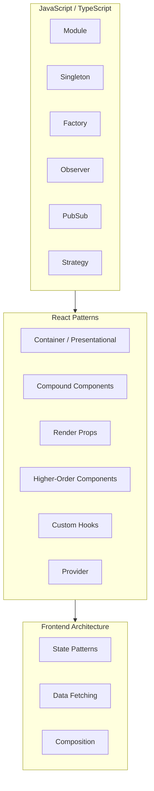

# Design Patterns for Frontend: JavaScript, TypeScript & React

A comprehensive reference for design patterns used in frontend development, with emphasis on React, JavaScript, and TypeScript.



---

## Part 1: JavaScript & TypeScript Patterns

### 1. Module Pattern

**What:** Encapsulate code in a single unit with private and public API. Avoid global namespace pollution.

**When:** Organize utilities, services, or feature logic; hide implementation details.

```javascript
// IIFE (classic)
const counterModule = (function () {
  let count = 0; // private

  return {
    increment() {
      count++;
      return count;
    },
    getCount() {
      return count;
    },
  };
})();

// ES modules (preferred)
// utils.js
let _cache = new Map();
export function getCached(key) {
  return _cache.get(key);
}
export function setCached(key, value) {
  _cache.set(key, value);
}
```

```typescript
// TypeScript: explicit types for public API
export interface CounterAPI {
  increment(): number;
  getCount(): number;
}

export function createCounter(): CounterAPI {
  let count = 0;
  return {
    increment() {
      count++;
      return count;
    },
    getCount() {
      return count;
    },
  };
}
```

---

### 2. Singleton Pattern

**What:** Ensure only one instance of a class or object exists (e.g. app config, API client, logger).

**When:** Shared state or resource that must be unique across the app.

```javascript
// Plain object (simplest)
const config = {
  apiUrl: 'https://api.example.com',
  theme: 'dark',
};

// Class-based singleton
class ApiClient {
  static instance = null;

  static getInstance() {
    if (!ApiClient.instance) {
      ApiClient.instance = new ApiClient();
    }
    return ApiClient.instance;
  }

  constructor() {
    if (ApiClient.instance) {
      return ApiClient.instance;
    }
    // init...
  }
}
```

```typescript
// TypeScript singleton with private constructor
class Logger {
  private static _instance: Logger | null = null;

  private constructor() {}

  static getInstance(): Logger {
    if (!Logger._instance) {
      Logger._instance = new Logger();
    }
    return Logger._instance;
  }

  log(message: string) {
    console.log(`[${new Date().toISOString()}] ${message}`);
  }
}
```

---

### 3. Factory Pattern

**What:** Create objects without specifying the exact class/type. Centralize creation logic.

**When:** Multiple variants of a type (buttons, modals, API clients); creation depends on config or environment.

```javascript
function createButton(type) {
  const buttons = {
    primary: () => ({ variant: 'primary', className: 'btn-primary' }),
    secondary: () => ({ variant: 'secondary', className: 'btn-secondary' }),
    danger: () => ({ variant: 'danger', className: 'btn-danger' }),
  };
  return (buttons[type] || buttons.primary)();
}
```

```typescript
// TypeScript: factory with discriminated union
type ButtonConfig = { variant: 'primary'; className: string } | { variant: 'secondary'; className: string };

function createButton(type: 'primary' | 'secondary'): ButtonConfig {
  switch (type) {
    case 'primary':
      return { variant: 'primary', className: 'btn-primary' };
    case 'secondary':
      return { variant: 'secondary', className: 'btn-secondary' };
    default:
      return { variant: 'primary', className: 'btn-primary' };
  }
}
```

---

### 4. Observer Pattern

**What:** One-to-many dependency: when one object (subject) changes state, all dependents (observers) are notified.

**When:** Decouple UI from data; real-time updates (live data, WebSocket).

```javascript
function createSubject() {
  const observers = new Set();

  return {
    subscribe(observer) {
      observers.add(observer);
      return () => observers.delete(observer);
    },
    notify(data) {
      observers.forEach((fn) => fn(data));
    },
  };
}

// Usage
const store = createSubject();
const unsub = store.subscribe((state) => console.log('Updated:', state));
store.notify({ count: 1 });
unsub();
```

```typescript
type Unsubscribe = () => void;

function createSubject<T>(): {
  subscribe: (observer: (data: T) => void) => Unsubscribe;
  notify: (data: T) => void;
} {
  const observers = new Set<(data: T) => void>();
  return {
    subscribe(observer) {
      observers.add(observer);
      return () => observers.delete(observer);
    },
    notify(data) {
      observers.forEach((fn) => fn(data));
    },
  };
}
```

---

### 5. Pub/Sub (Publish-Subscribe) Pattern

**What:** Decouple publishers and subscribers via a message channel (event bus). Publishers emit events by name; subscribers listen by event name.

**When:** Cross-cutting concerns, cross-component communication without prop drilling.

```javascript
function createEventBus() {
  const listeners = {};

  return {
    on(event, callback) {
      if (!listeners[event]) listeners[event] = [];
      listeners[event].push(callback);
      return () => {
        listeners[event] = listeners[event].filter((cb) => cb !== callback);
      };
    },
    emit(event, payload) {
      (listeners[event] || []).forEach((cb) => cb(payload));
    },
  };
}

const bus = createEventBus();
bus.on('user:login', (user) => console.log('Logged in', user));
bus.emit('user:login', { id: 1, name: 'Jane' });
```

```typescript
type EventMap = Record<string, unknown>;

function createEventBus<M extends EventMap>() {
  const listeners: { [K in keyof M]?: ((payload: M[K]) => void)[] } = {};

  return {
    on<K extends keyof M>(event: K, callback: (payload: M[K]) => void) {
      if (!listeners[event]) listeners[event] = [];
      listeners[event]!.push(callback);
      return () => {
        listeners[event] = listeners[event]!.filter((cb) => cb !== callback);
      };
    },
    emit<K extends keyof M>(event: K, payload: M[K]) {
      (listeners[event] || []).forEach((cb) => cb(payload));
    },
  };
}

type AppEvents = { 'user:login': { id: number; name: string }; 'cart:update': number };
const bus = createEventBus<AppEvents>();
bus.on('user:login', (user) => console.log(user.name));
bus.emit('user:login', { id: 1, name: 'Jane' });
```

---

### 6. Strategy Pattern

**What:** Define a family of algorithms (strategies), encapsulate each one, and make them interchangeable.

**When:** Multiple ways to do the same thing (validation, formatting, sorting) that you want to swap at runtime.

```javascript
const formatters = {
  uppercase: (str) => str.toUpperCase(),
  lowercase: (str) => str.toLowerCase(),
  capitalize: (str) => str.charAt(0).toUpperCase() + str.slice(1).toLowerCase(),
};

function format(str, strategy = 'capitalize') {
  return (formatters[strategy] || formatters.capitalize)(str);
}
```

```typescript
type FormatStrategy = (str: string) => string;

const formatters: Record<string, FormatStrategy> = {
  uppercase: (str) => str.toUpperCase(),
  lowercase: (str) => str.toLowerCase(),
  capitalize: (str) => str.charAt(0).toUpperCase() + str.slice(1).toLowerCase(),
};

function format(str: string, strategy: keyof typeof formatters = 'capitalize'): string {
  return formatters[strategy](str);
}
```

---

### 7. Builder Pattern (Optional, for complex config)

**What:** Construct complex objects step by step with a fluent API.

**When:** Objects with many optional fields or nested config (e.g. request builders, form config).

```typescript
class QueryBuilder {
  private params: Record<string, string> = {};

  where(key: string, value: string) {
    this.params[key] = value;
    return this;
  }

  sort(field: string, order: 'asc' | 'desc' = 'asc') {
    this.params.sort = `${field}:${order}`;
    return this;
  }

  build(): string {
    return new URLSearchParams(this.params).toString();
  }
}

const query = new QueryBuilder().where('status', 'active').sort('date', 'desc').build();
```

---

## Part 2: React Component & State Patterns

### 8. Container / Presentational (Smart & Dumb Components)

**What:** Split logic (data, side effects) into container components and UI (pure rendering) into presentational components.

**When:** Reusable UI that can be driven by different data sources; easier testing of pure UI.

```tsx
// Presentational: no hooks, no API, just props
type UserListProps = {
  users: { id: number; name: string }[];
  loading: boolean;
  error: string | null;
};

function UserList({ users, loading, error }: UserListProps) {
  if (loading) return <div>Loading...</div>;
  if (error) return <div>Error: {error}</div>;
  return (
    <ul>
      {users.map((u) => (
        <li key={u.id}>{u.name}</li>
      ))}
    </ul>
  );
}

// Container: data fetching, state, pass to presentational
function UserListContainer() {
  const [users, setUsers] = useState([]);
  const [loading, setLoading] = useState(true);
  const [error, setError] = useState<string | null>(null);

  useEffect(() => {
    fetch('/api/users')
      .then((r) => r.json())
      .then(setUsers)
      .catch((e) => setError(e.message))
      .finally(() => setLoading(false));
  }, []);

  return <UserList users={users} loading={loading} error={error} />;
}
```

---

### 9. Compound Components

**What:** A set of components that work together and share implicit state (e.g. `<Select>` + `<Select.Option>`). Parent holds state; children receive it via context or cloneElement.

**When:** Flexible, readable API for complex UI (tabs, accordion, dropdown).

```tsx
import { createContext, useContext, useState, ReactNode } from 'react';

type TabsContextValue = { active: string; setActive: (id: string) => void };

const TabsContext = createContext<TabsContextValue | null>(null);

function useTabs() {
  const ctx = useContext(TabsContext);
  if (!ctx) throw new Error('Tabs components must be used within Tabs');
  return ctx;
}

export function Tabs({ children, defaultValue }: { children: ReactNode; defaultValue: string }) {
  const [active, setActive] = useState(defaultValue);
  return (
    <TabsContext.Provider value={{ active, setActive }}>
      <div className="tabs">{children}</div>
    </TabsContext.Provider>
  );
}

function TabsList({ children }: { children: ReactNode }) {
  return <div role="tablist">{children}</div>;
}

function TabsTrigger({ value, children }: { value: string; children: ReactNode }) {
  const { active, setActive } = useTabs();
  return (
    <button role="tab" aria-selected={active === value} onClick={() => setActive(value)}>
      {children}
    </button>
  );
}

function TabsContent({ value, children }: { value: string; children: ReactNode }) {
  const { active } = useTabs();
  if (active !== value) return null;
  return <div role="tabpanel">{children}</div>;
}

Tabs.List = TabsList;
Tabs.Trigger = TabsTrigger;
Tabs.Content = TabsContent;

// Usage
<Tabs defaultValue="a">
  <Tabs.List>
    <Tabs.Trigger value="a">Tab A</Tabs.Trigger>
    <Tabs.Trigger value="b">Tab B</Tabs.Trigger>
  </Tabs.List>
  <Tabs.Content value="a">Content A</Tabs.Content>
  <Tabs.Content value="b">Content B</Tabs.Content>
</Tabs>
```

---

### 10. Render Props

**What:** A component receives a function as a prop (or children) and calls it with data/callbacks, letting the parent decide what to render.

**When:** Reuse logic while keeping rendering flexible (before hooks, common for mouse position, fetch state).

```tsx
type FetchRenderProps<T> = {
  data: T | null;
  loading: boolean;
  error: Error | null;
  refetch: () => void;
};

type FetchProps<T> = {
  url: string;
  children: (props: FetchRenderProps<T>) => React.ReactNode;
};

function Fetch<T>({ url, children }: FetchProps<T>) {
  const [data, setData] = useState<T | null>(null);
  const [loading, setLoading] = useState(true);
  const [error, setError] = useState<Error | null>(null);

  const fetchData = useCallback(() => {
    setLoading(true);
    fetch(url)
      .then((r) => r.json())
      .then(setData)
      .catch(setError)
      .finally(() => setLoading(false));
  }, [url]);

  useEffect(() => {
    fetchData();
  }, [fetchData]);

  return <>{children({ data, loading, error, refetch: fetchData })}</>;
}

// Usage
<Fetch<User[]>> url="/api/users">
  {({ data, loading, error }) => {
    if (loading) return <Spinner />;
    if (error) return <Error message={error.message} />;
    return <UserList users={data!} />;
  }}
</Fetch>
```

---

### 11. Higher-Order Component (HOC)

**What:** A function that takes a component and returns a new component with extra props or behavior (auth, logging, data injection).

**When:** Cross-cutting concerns; less common now that custom hooks cover many use cases.

```tsx
function withAuth<P extends object>(WrappedComponent: React.ComponentType<P>) {
  return function WithAuthComponent(props: P) {
    const { user, loading } = useAuth();
    if (loading) return <Spinner />;
    if (!user) return <Navigate to="/login" />;
    return <WrappedComponent {...props} user={user} />;
  };
}

const DashboardWithAuth = withAuth(Dashboard);
```

```tsx
// With forwarded ref (TypeScript)
function withLogger<P extends object>(WrappedComponent: React.ComponentType<P>) {
  const WithLogger = React.forwardRef<unknown, P>((props, ref) => {
    useEffect(() => {
      console.log('Mounted:', WrappedComponent.displayName);
      return () => console.log('Unmounted:', WrappedComponent.displayName);
    }, []);
    return <WrappedComponent {...props} ref={ref} />;
  });
  WithLogger.displayName = `WithLogger(${WrappedComponent.displayName || 'Component'})`;
  return WithLogger;
}
```

---

### 12. Custom Hooks (Logic Reuse)

**What:** Extract stateful logic into reusable functions. Preferred over HOCs and render props for sharing logic in React.

**When:** Shared logic (fetching, form state, subscriptions, debounce).

```tsx
function useFetch<T>(url: string | null) {
  const [data, setData] = useState<T | null>(null);
  const [loading, setLoading] = useState(true);
  const [error, setError] = useState<Error | null>(null);

  useEffect(() => {
    if (!url) {
      setLoading(false);
      return;
    }
    let cancelled = false;
    setLoading(true);
    fetch(url)
      .then((r) => r.json())
      .then((d) => !cancelled && setData(d))
      .catch((e) => !cancelled && setError(e))
      .finally(() => !cancelled && setLoading(false));
    return () => {
      cancelled = true;
    };
  }, [url]);

  return { data, loading, error };
}
```

```tsx
function useLocalStorage<T>(key: string, initial: T): [T, (value: T) => void] {
  const [state, setState] = useState<T>(() => {
    try {
      const item = window.localStorage.getItem(key);
      return item ? JSON.parse(item) : initial;
    } catch {
      return initial;
    }
  });

  const setValue = useCallback(
    (value: T) => {
      setState(value);
      try {
        window.localStorage.setItem(key, JSON.stringify(value));
      } catch (e) {
        console.error(e);
      }
    },
    [key]
  );

  return [state, setValue];
}
```

---

### 13. Provider Pattern (Context)

**What:** Supply shared state or services to a subtree via React Context. Consumers use the value without prop drilling.

**When:** Theme, auth, i18n, API client, feature flags.

```tsx
type ThemeContextValue = { theme: 'light' | 'dark'; toggle: () => void };

const ThemeContext = createContext<ThemeContextValue | null>(null);

export function ThemeProvider({ children }: { children: React.ReactNode }) {
  const [theme, setTheme] = useState<'light' | 'dark'>('light');
  const toggle = useCallback(() => {
    setTheme((t) => (t === 'light' ? 'dark' : 'light'));
  }, []);
  return (
    <ThemeContext.Provider value={{ theme, toggle }}>
      {children}
    </ThemeContext.Provider>
  );
}

export function useTheme() {
  const ctx = useContext(ThemeContext);
  if (!ctx) throw new Error('useTheme must be used within ThemeProvider');
  return ctx;
}
```

---

### 14. Controlled vs Uncontrolled (Form Pattern)

**What:** Controlled: React state is source of truth for input values. Uncontrolled: DOM holds value; access via ref when needed.

**When:** Controlled for validation, dynamic UI, single source of truth. Uncontrolled for simple forms or integrating with non-React libs.

```tsx
// Controlled
function ControlledForm() {
  const [email, setEmail] = useState('');
  const [password, setPassword] = useState('');
  return (
    <form onSubmit={(e) => e.preventDefault()}>
      <input value={email} onChange={(e) => setEmail(e.target.value)} />
      <input type="password" value={password} onChange={(e) => setPassword(e.target.value)} />
      <button type="submit">Submit</button>
    </form>
  );
}

// Uncontrolled
function UncontrolledForm() {
  const formRef = useRef<HTMLFormElement>(null);
  const handleSubmit = (e: React.FormEvent) => {
    e.preventDefault();
    const form = formRef.current;
    if (!form) return;
    const data = new FormData(form);
    console.log(Object.fromEntries(data));
  };
  return (
    <form ref={formRef} onSubmit={handleSubmit}>
      <input name="email" defaultValue="" />
      <input name="password" type="password" defaultValue="" />
      <button type="submit">Submit</button>
    </form>
  );
}
```

---

### 15. State Reducer Pattern (Flexible State Logic)

**What:** Let the parent override or extend state transitions by passing a reducer function (similar to how useReducer works, but injectable).

**When:** Reusable components (dropdown, accordion) where the consumer might want to veto or add transitions.

```tsx
type State = { open: boolean };
type Action = { type: 'OPEN' } | { type: 'CLOSE' } | { type: 'TOGGLE' };

const defaultReducer = (state: State, action: Action): State => {
  switch (action.type) {
    case 'OPEN':
      return { open: true };
    case 'CLOSE':
      return { open: false };
    case 'TOGGLE':
      return { open: !state.open };
    default:
      return state;
  }
};

type UseToggleProps = {
  initial?: boolean;
  reducer?: (state: State, action: Action) => State;
};

function useToggle({ initial = false, reducer = defaultReducer }: UseToggleProps = {}) {
  const [state, dispatch] = useReducer(reducer, { open: initial });
  const open = () => dispatch({ type: 'OPEN' });
  const close = () => dispatch({ type: 'CLOSE' });
  const toggle = () => dispatch({ type: 'TOGGLE' });
  return { open: state.open, openFn: open, closeFn: close, toggle };
}

// Consumer can pass custom reducer to prevent closing in some cases, etc.
```

---

## Part 3: Data Fetching & Async Patterns

### 16. Data Fetching with Hooks (Request Lifecycle)

**What:** Centralize loading, success, and error in one hook; support refetch and cleanup (e.g. abort on unmount).

```tsx
function useQuery<T>(url: string | null) {
  const [state, setState] = useState<{
    data: T | null;
    loading: boolean;
    error: Error | null;
  }>({ data: null, loading: !!url, error: null });

  const refetch = useCallback(() => {
    if (!url) return;
    setState((s) => ({ ...s, loading: true, error: null }));
    const controller = new AbortController();
    fetch(url, { signal: controller.signal })
      .then((r) => r.json())
      .then((data) => setState({ data, loading: false, error: null }))
      .catch((err) => {
        if (err.name !== 'AbortError') {
          setState((s) => ({ ...s, loading: false, error: err }));
        }
      });
    return () => controller.abort();
  }, [url]);

  useEffect(() => {
    refetch();
  }, [refetch]);

  return { ...state, refetch };
}
```

---

### 17. Optimistic Updates

**What:** Update UI immediately as if the mutation succeeded; roll back and show error if the request fails.

**When:** Better perceived performance (likes, toggles, inline edits).

```tsx
function useOptimisticUpdate<T>(
  mutationFn: (payload: T) => Promise<unknown>,
  onSuccess?: () => void,
  onError?: (e: Error) => void
) {
  const [error, setError] = useState<Error | null>(null);

  const mutate = useCallback(
    (payload: T, optimisticState: () => void) => {
      optimisticState(); // Update UI immediately
      mutationFn(payload)
        .then(() => {
          setError(null);
          onSuccess?.();
        })
        .catch((e) => {
          setError(e);
          onError?.(e);
          // Optionally: revert optimisticState by refetching or restoring previous state
        });
    },
    [mutationFn, onSuccess, onError]
  );

  return { mutate, error };
}
```

---

## Part 4: Structural & Composition Patterns

### 18. Composition over Inheritance

**What:** Build UIs by composing small components (slots, children) instead of extending base components.

**When:** Always in React; keeps components focused and reusable.

```tsx
// Composition: layout receives children/slots
function Card({
  title,
  children,
  actions,
}: {
  title: string;
  children: React.ReactNode;
  actions?: React.ReactNode;
}) {
  return (
    <div className="card">
      <div className="card-header">
        <h2>{title}</h2>
        {actions}
      </div>
      <div className="card-body">{children}</div>
    </div>
  );
}

// Usage
<Card title="Profile" actions={<Button>Edit</Button>}>
  <p>Content here</p>
</Card>
```

---

### 19. Slot / Layout Pattern

**What:** Reserve named “slots” (header, footer, sidebar) so the parent can inject content. Often via props or children as object.

```tsx
type PageLayoutProps = {
  header?: React.ReactNode;
  sidebar?: React.ReactNode;
  children: React.ReactNode;
  footer?: React.ReactNode;
};

function PageLayout({ header, sidebar, children, footer }: PageLayoutProps) {
  return (
    <div className="page">
      {header && <header className="page-header">{header}</header>}
      <div className="page-body">
        {sidebar && <aside className="page-sidebar">{sidebar}</aside>}
        <main className="page-main">{children}</main>
      </div>
      {footer && <footer className="page-footer">{footer}</footer>}
    </div>
  );
}
```

---

### 20. Façade Pattern (API / Service Layer)

**What:** Provide a simple interface to a complex subsystem (e.g. one `api` object that wraps fetch, auth, base URL, error handling).

**When:** Hide complexity; single place to change API client or auth.

```typescript
// api.ts
const BASE = import.meta.env.VITE_API_URL;

async function request<T>(path: string, options?: RequestInit): Promise<T> {
  const token = getToken();
  const res = await fetch(`${BASE}${path}`, {
    ...options,
    headers: {
      'Content-Type': 'application/json',
      ...(token ? { Authorization: `Bearer ${token}` } : {}),
      ...options?.headers,
    },
  });
  if (!res.ok) throw new Error(await res.text());
  return res.json();
}

export const api = {
  get: <T>(path: string) => request<T>(path),
  post: <T>(path: string, body: unknown) =>
    request<T>(path, { method: 'POST', body: JSON.stringify(body) }),
  put: <T>(path: string, body: unknown) =>
    request<T>(path, { method: 'PUT', body: JSON.stringify(body) }),
  delete: <T>(path: string) => request<T>(path, { method: 'DELETE' }),
};
```

---

## Part 5: Performance & Rendering Patterns

### 21. List Virtualization (Windowing)

**What:** Render only the visible portion of a long list (plus buffer). Reduces DOM nodes and improves scroll performance.

**When:** Long lists (100+ items). Use libraries like `react-window` or `@tanstack/react-virtual`.

```tsx
// Conceptual: only render visible indices
function VirtualList({ items, itemHeight, containerHeight }: Props) {
  const [scrollTop, setScrollTop] = useState(0);
  const start = Math.floor(scrollTop / itemHeight);
  const end = Math.min(items.length, start + Math.ceil(containerHeight / itemHeight) + 2);
  const visible = items.slice(start, end);

  return (
    <div
      style={{ height: containerHeight, overflow: 'auto' }}
      onScroll={(e) => setScrollTop(e.currentTarget.scrollTop)}
    >
      <div style={{ height: items.length * itemHeight, position: 'relative' }}>
        {visible.map((item, i) => (
          <div key={item.id} style={{ position: 'absolute', top: (start + i) * itemHeight }}>
            {item.content}
          </div>
        ))}
      </div>
    </div>
  );
}
```

---

### 22. Code Splitting & Lazy Loading

**What:** Load parts of the app only when needed (routes, modals, heavy components). Use `React.lazy` and `Suspense`.

**When:** Reduce initial bundle size; improve time-to-interactive.

```tsx
const Dashboard = React.lazy(() => import('./Dashboard'));
const Settings = React.lazy(() => import('./Settings'));

function App() {
  return (
    <Suspense fallback={<PageLoader />}>
      <Routes>
        <Route path="/dashboard" element={<Dashboard />} />
        <Route path="/settings" element={<Settings />} />
      </Routes>
    </Suspense>
  );
}
```

---

## Quick Reference Table

| Pattern | Use case |
|--------|----------|
| Module | Encapsulation, avoid globals |
| Singleton | Single instance (config, API client) |
| Factory | Create variants by type/config |
| Observer / PubSub | Decouple producers and consumers |
| Strategy | Swappable algorithms (format, validate) |
| Container/Presentational | Separate logic and UI |
| Compound Components | Flexible shared-state UI (Tabs, Select) |
| Render Props | Reuse logic, flexible rendering |
| HOC | Cross-cutting (auth, logging) |
| Custom Hooks | Reuse stateful logic |
| Provider | Theme, auth, i18n, API |
| State Reducer | Overridable state transitions |
| Optimistic Update | Instant UI, rollback on error |
| Composition / Slots | Layout and reuse |
| Façade | Simple API over complex subsystem |
| Virtualization | Long lists |
| Code splitting | Lazy load routes/heavy components |
